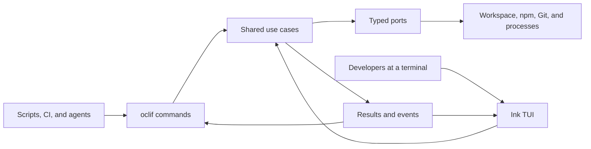
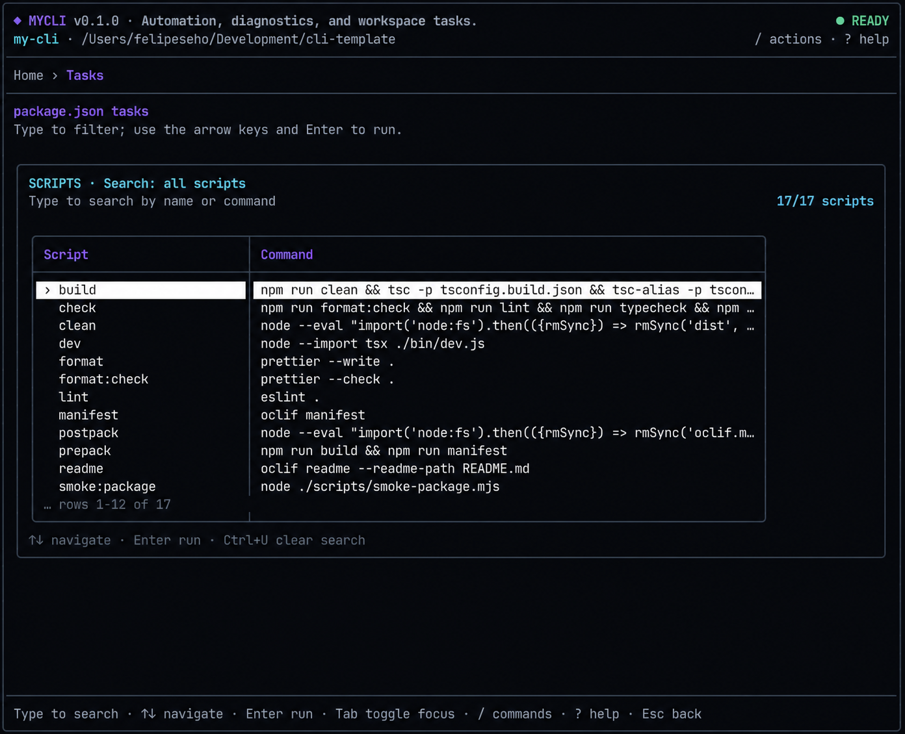

<p align="center">
  
</p>

<h1 align="center">Build a CLI people want to use.</h1>

<p align="center">
  A production-minded TypeScript template that gives automation and humans the experience each one
  deserves: fast oclif commands, a polished Ink interface, and one shared application core.
</p>

<p align="center">
  <a href="https://github.com/felipeseho/cli-template/actions/workflows/ci.yml">
    
  </a>
  
  
  
  
  
</p>

<p align="center">
  <a href="#quick-start"><strong>Use this template</strong></a>
  ·
  <a href="docs/architecture.md">Explore the architecture</a>
  ·
  <a href="docs/adding-a-command.md">Add a command</a>
</p>

## Why this template?

Most CLI projects eventually choose between a script-friendly command surface and a rich
interactive experience. This template starts with both—and keeps them consistent by design.

| For automation                | For humans                             |
| ----------------------------- | -------------------------------------- |
| Hierarchical oclif commands   | Responsive React and Ink TUI           |
| Stable, ANSI-free JSON        | Searchable lists and command palette   |
| Predictable exit codes        | Live progress, logs, and cancellation  |
| Stream-safe process execution | Keyboard-first navigation              |
| Package-level smoke tests     | Alternate-screen lifecycle and cleanup |

The command layer and the TUI are delivery adapters. They call the same use cases, consume the same
typed events, and never duplicate business rules.



## What you get
### Give humans a first-class terminal experience

The TUI runs as a single Ink root with a responsive dashboard, searchable tasks, diagnostics,
keyboard navigation, live output, cancellation, and reliable terminal cleanup.

<p align="center">
  
</p>

## Quick start

> [!NOTE]
> This repository is a template. Before publishing a project created from it, replace `my-cli`,
> `mycli`, and the placeholder metadata using the
> [customization checklist](docs/using-the-template.md).

### Requirements

- Node.js `>=24.15`
- npm `12.0.2`, declared in `package.json#packageManager`
- Git
- A TTY-capable terminal for the dashboard; text and JSON modes also work without one

### Run the template

Create a repository from this GitHub template, clone it, then run:

```bash
npm install
npm run build
./bin/run.js
./bin/run.js --help
```

Use the TypeScript development entrypoint while iterating:

```bash
./bin/dev.js
./bin/dev.js doctor
./bin/dev.js task list
```

On Windows, use the npm scripts:

```powershell
npm run dev -- doctor
npm run dev -- task list
```

## Command experience

| Command                   | With a TTY                        | Without a TTY / `--no-interactive` |
| ------------------------- | --------------------------------- | ---------------------------------- |
| `mycli`                   | Opens Dashboard Home              | Shows branded root help            |
| `mycli task list`         | Opens the searchable task browser | Lists scripts as text              |
| `mycli task run <script>` | Opens the task runner             | Streams safe text output           |
| `mycli doctor`            | Opens diagnostics                 | Prints the diagnostic report       |
| `mycli ... --json`        | Emits JSON; takes priority        | Emits JSON                         |

Delivery is adaptive: commands with a dashboard route mount that route when stdin and stdout are
TTYs, and fall back to plain text when either stream is not a TTY. `--no-interactive` forces that
text fallback. `--json` takes precedence and may be combined with `--no-interactive`.

`task run` accepts only names already declared in `package.json#scripts`; arbitrary shell commands
are intentionally outside the template's scope. The former `ui` command, `--interactive`, and `-i`
are not part of the public interface.

Exit codes are part of the contract:

- `0` for success;
- `2` for invalid usage;
- `130` for cancellation;
- the child process exit code when a task fails.

## Architecture

```text
src/
  commands/              thin oclif delivery adapters
  features/
    <feature>/
      core/              framework-independent use cases and contracts
      adapters/          concrete infrastructure
      cli/               presenters, DTOs, and error mapping
      tui/               feature screens and state controllers
  runtime/               composition root, signals, TTY, and Ink mounting
  tui/                   global shell, routing, components, and keymap
```

Local source imports use the `@/*` alias and end in `.js` for Node ESM compatibility. The build
emits TypeScript and then rewrites aliases to valid relative imports with `tsc-alias`.

Read [Architecture](docs/architecture.md) for dependency rules, runtime flows, and package
boundaries.

## Customize and develop

This repository includes a project-local `$create-command` skill. Ask Codex to use it and it will
collect the command ID, description, aliases, arguments, flags, and examples before generating a
compilable oclif scaffold with a visible `console.log` placeholder.

For a production feature shared by CLI and TUI, follow
[Adding a command and screen](docs/adding-a-command.md).

### Development workflow

```bash
npm run format:check
npm run lint
npm run typecheck
npm test
npm run build
npm run manifest
npm run smoke:package
```

`npm run check` runs the main local quality gate. The package smoke test is intentionally separate
because it builds and installs the real tarball.

### Own the UI source

termcn follows the shadcn model: component source is copied into the repository and becomes part of
the product. There is no registry dependency at runtime or in CI. Add, customize, and review
components like any other application code.

The dashboard uses source-owned termcn primitives for breadcrumbs, alerts, progress, dialogs,
spinners, logs, tables, and focus scopes. Its product colors and symbols come from neutral shared
tokens also consumed by the static help renderer. Long-running commands only display a percentage
when the underlying operation exposes a real total; npm scripts use phase progress and elapsed time
instead.

See [Using termcn](docs/termcn.md) for registry aliases, vendored source conventions, themes, and
Node ESM requirements.

### Make the template yours

The package starts with `"private": true` to prevent accidental publishing. The
[template guide](docs/using-the-template.md) covers:

- creating a repository from the GitHub template;
- renaming the package and binary safely;
- validating adaptive dashboard, plain-text, JSON, help, and packaged behavior;
- reviewing the tarball before publication.

## Documentation

- [Architecture](docs/architecture.md)
- [Adding a command and screen](docs/adding-a-command.md)
- [Using termcn](docs/termcn.md)
- [Using and customizing the template](docs/using-the-template.md)

## Ready to build?

Start with the domain behavior your CLI should own. Expose it through a focused oclif command,
bring it to life in Ink when interaction adds value, and let the shared core keep both experiences
aligned.

Licensed under the [MIT License](LICENSE).
