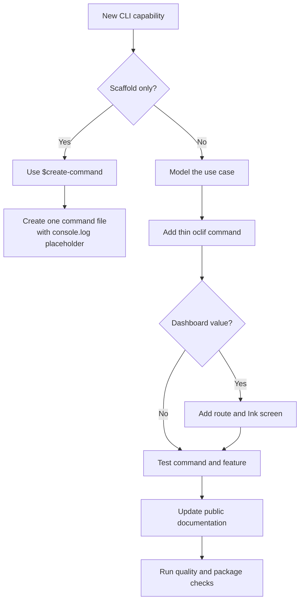
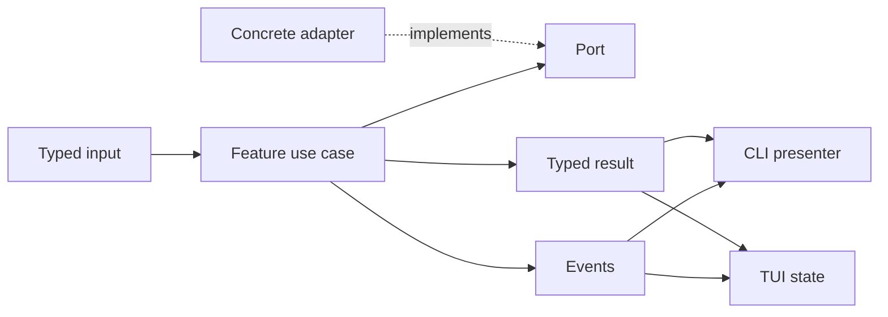
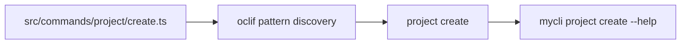

# Adding a command and screen

Use this guide when a capability needs an automation-friendly command, a dashboard screen, or both.
The architecture keeps delivery choices separate from business behavior and chooses the best
delivery adaptively, so start by deciding which level of change you need.

## Choose the right path



For a metadata-only command scaffold, use the repository's `$create-command` Codex skill. It asks
for the ID, description, aliases, arguments, flags, and examples, then creates a compilable file in
`src/commands/` whose only behavior is a visible `console.log` placeholder.

For real product behavior, follow the workflow below. If the feature is textual only, skip the TUI
step but keep the use case independent from oclif.

## 1. Model the use case

Create `src/features/<feature>/core/` with:

- input, result, and event types;
- ports for external effects;
- a function or class that coordinates the operation;
- stable error types for expected failures.

The core must not import oclif, React, Ink, Execa, Node.js APIs, or concrete infrastructure.
Commands and screens need to present the same failure differently, so expected errors must remain
typed and transport-neutral.

For long-running work, publish discriminated events instead of writing to the terminal:

```ts
export type ExampleEvent =
  | {type: 'started'}
  | {type: 'output'; stream: 'stdout' | 'stderr'; text: string}
  | {type: 'completed'; durationMs: number}
  | {type: 'failed'; message: string}
  | {type: 'cancelled'}
```

Expose only public core contracts from `src/features/<feature>/index.ts`. Imports inside the feature
remain relative; consumers outside the feature use that root entrypoint.

Implement each concrete port in `src/features/<feature>/adapters/` and register it in the runtime
container. An adapter never instantiates another adapter; only the composition root knows concrete
implementations.



## 2. Define CLI presentation

Add human presentation, error mapping, and output DTOs to `src/features/<feature>/cli/`. Use
`src/cli/` only for shared tables, sanitization, serialization, and base error behavior.

Decide the public contract before implementing:

- the success shape;
- the expected error shape;
- exit codes;
- which events stream in human mode;
- whether the command supports JSON;
- whether a dashboard route adds real value.

JSON is a public API. It must contain only data and remain free from ANSI, progress messages,
spinners, and textual logs. Emit exactly one document at the end.

Do not create identity wrappers around results. When the public JSON shape differs from the use-case
result, create a typed mapper and return its DTO.

## 3. Add the oclif class

Create `src/commands/<topic>/<name>.ts`. With `"topicSeparator": " "`, the path
`src/commands/project/create.ts` becomes `mycli project create`.



Do not register the command manually. Development rediscovers source files because the generated
manifest is ignored and removed before startup. Packaging recreates the manifest from the production
build.

The class should do only the following:

1. declare aliases, arguments, flags, description, examples, and summary;
2. call `this.parse()`;
3. resolve delivery with JSON first, then text for `--no-interactive` or a missing TTY, and TUI
   otherwise;
4. validate input that can fail before mounting a screen;
5. obtain dependencies from the composition root;
6. call the use case or dashboard runtime;
7. present the result and set the exit code.

Use `BaseCommand` when the command participates in the project's JSON and central error contracts.
When the command also has a dashboard route, derive from `DashboardCommand`, which is exported from
the same module and adds `--no-interactive` without a short alias. Do not add `--interactive` or a
standalone command that only opens the TUI. `--json` may be combined with `--no-interactive` and
takes priority.

Descriptions, examples, arguments, and flags also feed the branded static help renderer. Keep those
metadata complete and in English; parsing failures use the same contextual renderer outside JSON
mode.

Do not call another oclif class to reuse behavior.

## 4. Add the route and screen

If interaction improves the experience, add a route to `ScreenRoute` and connect it in
`src/tui/router.tsx`. Place feature-specific screens and controllers in
`src/features/<feature>/tui/`.

The screen should:

- receive services and state through props or context, not mutable global modules;
- accept initial route input from the invoking command when applicable;
- start effects in hooks and cancel pending work when unmounted;
- represent `idle`, `loading`, `success`, `failure`, and `cancelled` when applicable;
- report asynchronous failure and final exit status back through the dashboard runtime;
- use primitives from `components/ui` and product compositions from `components/app`;
- work in one column and use two columns when enough width is available;
- provide an `Esc` path and respect global `Ctrl+C` behavior.

Register the action on Home and in the command palette. Change `keymap.ts` only for global shortcuts;
local shortcuts stay near the screen that owns them.

During Ink rendering, never use `console.log`, `this.log()`, or oclif spinners. Convert use-case
events into visual state.

## 5. Test every changed boundary

### Feature tests

Cover:

- success with fake ports;
- validation and expected failures;
- event order;
- cancellation and resource release;
- feature-specific adapters, presenters, DTOs, and error mappers.

### Command tests

Cover:

- all eight combinations of TTY availability, `--json`, and `--no-interactive` when both delivery
  flags are supported;
- help, positional arguments, and flags;
- default TUI delivery with stdin and stdout attached to a TTY;
- plain human output without a TTY and with `--no-interactive`;
- parseable JSON without ANSI;
- JSON taking priority with and without `--no-interactive` or a TTY;
- removed `--interactive`, `-i`, and `ui` surfaces returning invalid usage when relevant;
- the route and initial screen input passed to the dashboard;
- asynchronous screen failures returning a nonzero exit code;
- preservation of child process exit codes.

### TUI tests

Cover:

- route and initial frame;
- navigation and shortcuts;
- loading and final frames;
- confirmation and cancellation;
- narrow and wide layouts when behavior changes with terminal width.

Organize feature tests under `test/features/<feature>/`. Global command, shell, routing, and package
tests remain in their integration folders.

Use a fixed width, `NO_MOTION=1`, and `NO_UNICODE=1` for visual tests. Avoid snapshots of elapsed
time or animation frames; assert semantic content from the final frame.

## 6. Update the public story

Add the command to the README command table. If it introduces a public JSON contract, document its
shape and exit behavior. If it changes contracts or dependencies between layers, update
`docs/architecture.md`.

## 7. Validate the result

Run the main quality gate:

```bash
npm run check
```

For command discovery and the installable artifact, also run:

```bash
npm run build
npm run manifest
npm run smoke:package
```

Before handing off, execute the command in development with safe values for every required argument
and flag, then confirm both its output and exit code.
