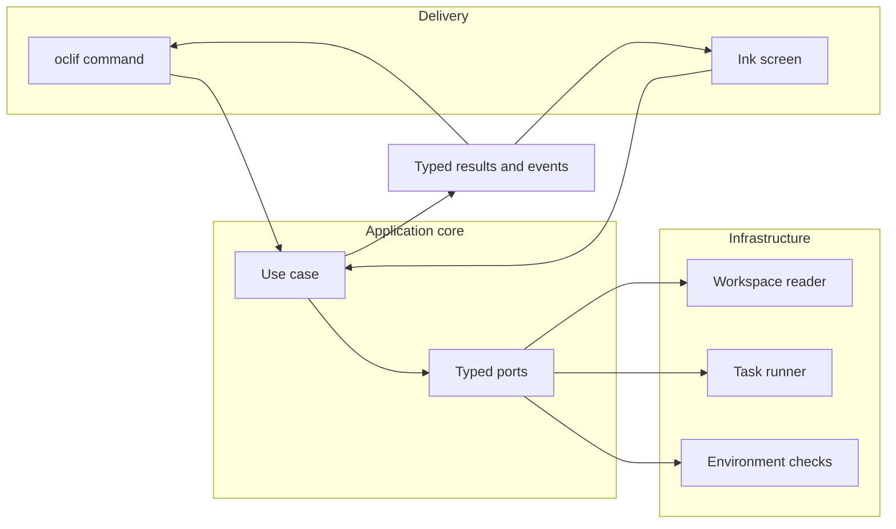
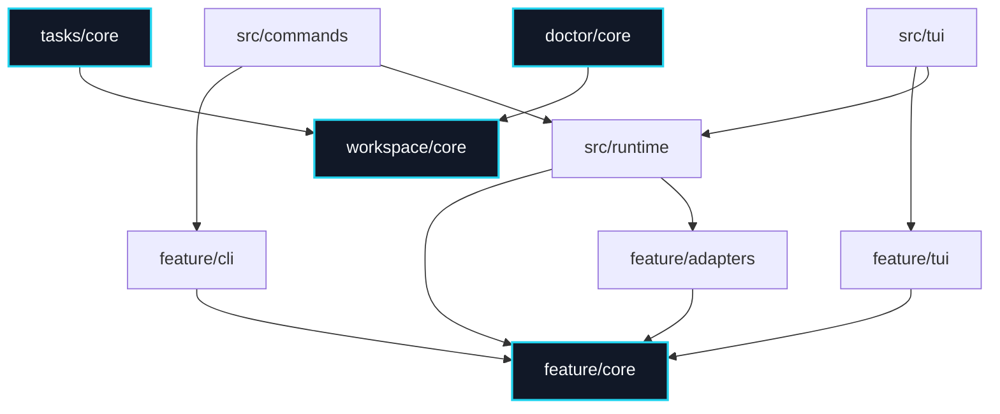
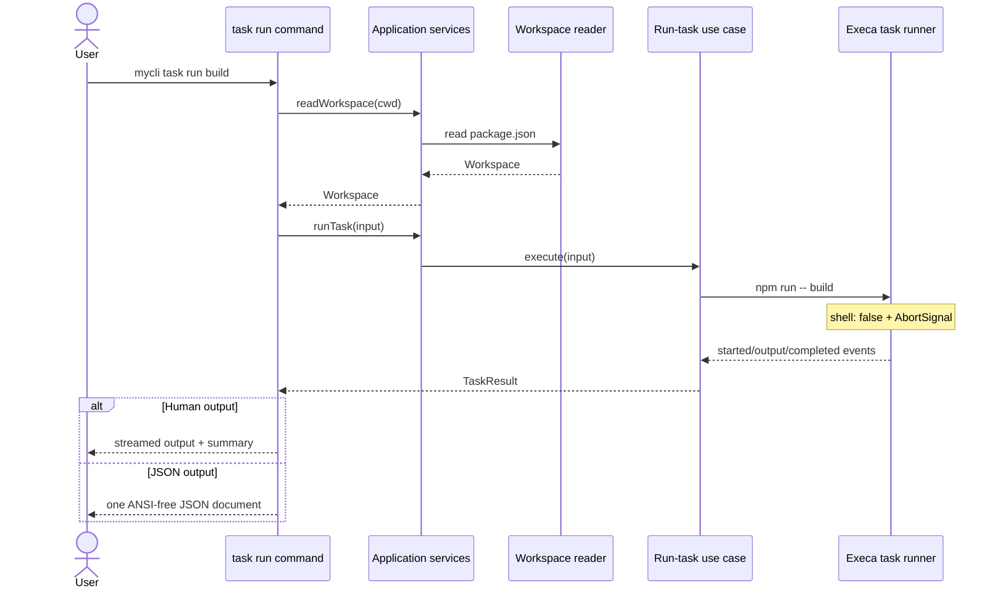
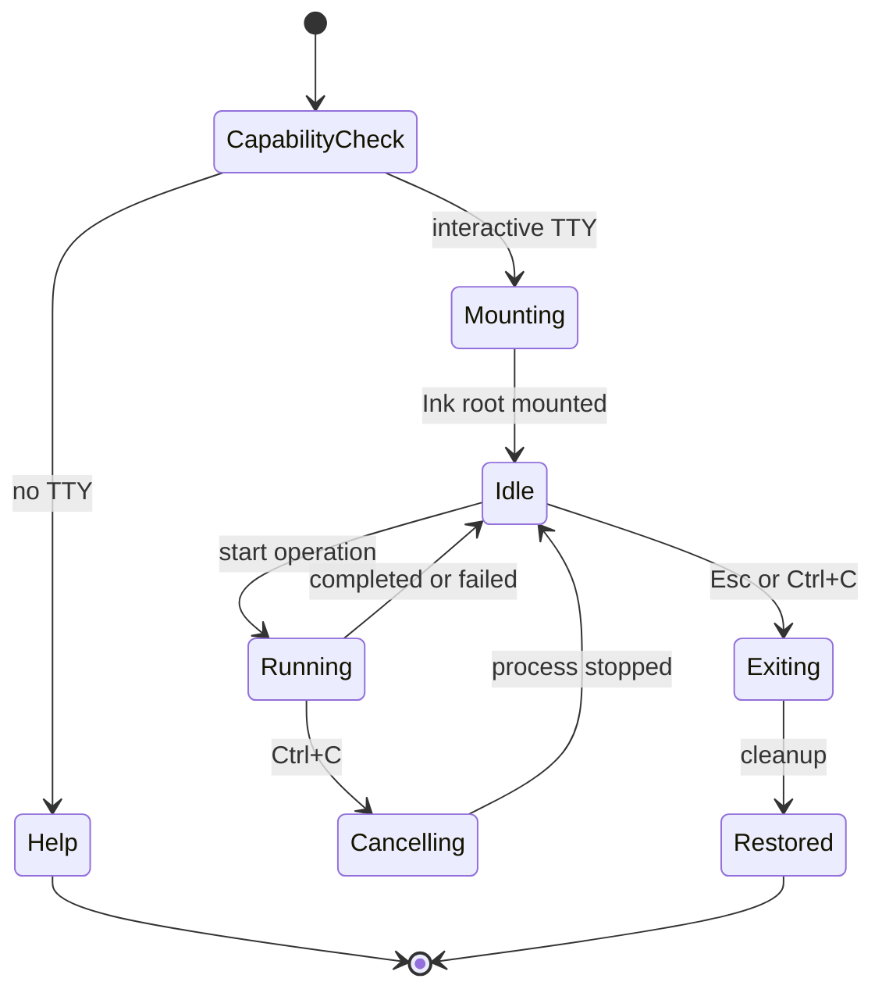
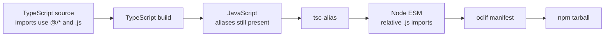

# Architecture

## Design goal

This template separates **intent**, **execution**, and **presentation**.

An oclif command and an Ink screen can expose the same capability, but neither one owns the
business rule and neither one calls the other. Both invoke a framework-independent use case and
translate its typed result or events for their audience.



This split keeps terminal lifecycle concerns out of domain behavior. Services do not call
`console.log` or `this.log()` and do not render spinners. They return data or publish events.

## Project map

```text
bin/
  dev.js
  run.js

src/
  index.ts
  cli/
  commands/
    ui.ts
    doctor.ts
    task/
      list.ts
      run.ts
  runtime/
  components/
    ui/
  lib/
    terminal-themes/
  providers/
  features/
    workspace/
      core/
      adapters/
      cli/
      tui/
    tasks/
      core/
      adapters/
      cli/
      tui/
    doctor/
      core/
      adapters/
      cli/
      tui/
  tui/
    app.tsx
    router.tsx
    routes.ts
    keymap.ts
    screens/
      home.tsx
      help.tsx
    components/
      ui/
      app/
    hooks/

test/
  features/
  cli/
  commands/
  tui/
  fixtures/
  package/

scripts/
docs/
.github/workflows/
```

## Dependency direction

Dependencies point inward toward contracts and use cases. ESLint encodes the important boundaries
so invalid imports fail the regular quality gate.



The rules behind this graph are:

- `core` depends only on explicitly allowed core contracts;
- feature `adapters`, `cli`, and `tui` depend inward and never import another feature's
  implementation;
- imports within a feature are relative;
- consumers outside a feature use its root `index.ts` to access the public core API;
- `workspace` is foundational and may be consumed by `tasks` and `doctor`;
- `tasks` and `doctor` remain independent from each other;
- only the composition root knows concrete implementations across layers.

## Directory responsibilities

### `bin/`

Minimal executable entrypoints:

- `dev.js` starts oclif from TypeScript/TSX sources during development;
- `run.js` loads compiled commands from `dist/`.

The generated manifest is ignored by Git so development always rediscovers source commands.
`dev.js` removes that disposable artifact before startup. Entrypoints contain no business logic.

### `src/commands/`

Thin oclif classes declare arguments, flags, descriptions, examples, and help. They parse input,
validate CLI-specific combinations, resolve application services, invoke a use case or the
interactive runtime, present the result, and set the exit code.

The file path determines the command ID. With `"topicSeparator": " "`,
`src/commands/task/list.ts` is discovered as `task list`.

Commands are not registered manually and never invoke another command class to share behavior.

### `src/runtime/`

The runtime is the composition and lifecycle boundary. It:

- builds the application service facade;
- wires ports to concrete adapters;
- detects TTY capabilities;
- installs and removes signal handlers;
- mounts the single Ink root;
- enters and leaves the alternate screen.

The caller always awaits `waitUntilExit()`, and terminal cleanup belongs in a `finally` block.
`services.ts` defines the facade consumed by commands and the TUI; only the container knows all
concrete implementations.

### `src/cli/`

Shared textual delivery infrastructure lives here:

- `BaseCommand`;
- JSON serialization without ANSI;
- terminal-text sanitization;
- reusable table formatting;
- the central CLI error contract.

Feature-specific presenters, output DTOs, and error mappers stay inside that feature's `cli/`
folder.

### `src/features/`

Features are vertical modules with up to four internal boundaries:

| Boundary   | Responsibility                                            |
| ---------- | --------------------------------------------------------- |
| `core`     | Types, ports, errors, and framework-independent use cases |
| `adapters` | Concrete implementations of the feature's ports           |
| `cli`      | Human presenters, JSON DTOs, and CLI error translation    |
| `tui`      | Feature screens and state controllers                     |

The current features are:

- `workspace`: discovers and reads the current workspace's `package.json`;
- `tasks`: lists declared npm scripts and runs a task while publishing typed events;
- `doctor`: aggregates environment checks into a typed diagnostic report.

The main public contracts include `Workspace`, `Task`, `TaskEvent`, `TaskResult`, and
`DiagnosticCheck`. Core code does not import oclif, Ink, React, Execa, Node.js APIs, or its own
outer delivery and infrastructure layers.

The task adapter invokes npm with a program and argument array, `shell: false`, an explicit working
directory, and an `AbortSignal`.

### `src/tui/`

This folder owns the shell of one Ink application:

- `screens/` contains global screens such as Home and Help;
- feature-specific screens remain in `src/features/<feature>/tui/`;
- `components/ui/` contains vendored termcn primitives;
- `components/app/` contains product-specific compositions;
- `hooks/` contains vendored termcn hooks;
- `routes.ts`, `router.tsx`, and `keymap.ts` define navigation and global keyboard behavior.

### `src/components/`, `src/lib/`, and `src/providers/`

These folders support the vendored termcn source. Shared component types live in `components`;
styles, symbols, text utilities, and terminal themes live in `lib`; the explicit `ThemeProvider`
lives in `providers`.

`components.json` maps registry artifacts to their real folders. Local imports use the `@/*` alias
instead of deep relative paths.

### `test/`

| Folder          | Coverage                                                     |
| --------------- | ------------------------------------------------------------ |
| `test/features` | Feature core, adapters, CLI presenters, and feature TUI      |
| `test/cli`      | Shared textual delivery helpers                              |
| `test/commands` | oclif behavior, streams, JSON, and exit codes                |
| `test/tui`      | Global frames, routing, keyboard input, and terminal runtime |
| `test/fixtures` | Deterministic workspaces                                     |
| `test/package`  | Helpers for validating the published artifact                |

### `scripts/`, `docs/`, and `.github/workflows/`

`scripts` contains maintenance automation outside the runtime, including the tarball smoke test.
`docs` captures extension workflows and architectural decisions. CI calls the same public npm
scripts available locally.

## Runtime flows

### Running a task



The use case validates the requested name against `package.json#scripts` before creating a process.
The `--` separator prevents script names beginning with a hyphen from becoming npm options. Output
events can stream without limit while retained stdout and stderr remain bounded in memory.

A single `AbortSignal` connects `Ctrl+C` to the child process. Cancellation returns `130` and the
runtime restores terminal state during teardown.

### Interactive lifecycle



The TUI is mounted once with `alternateScreen: true`. While an operation is active, `Ctrl+C` means
cancel; while idle, it means exit. Screens convert use-case events into state instead of writing to
stdout during rendering.

## TypeScript, aliases, and the manifest

`tsconfig.json` covers `src` with `rootDir: src`, `outDir: dist`, strict mode, and NodeNext module
resolution. `tsconfig.test.json` expands the typecheck scope for tests without changing the build
contract. `tsconfig.build.json` emits JavaScript and declaration files.



The build uses native TypeScript 7. `typescript-eslint` still consumes the TypeScript JavaScript API,
so the compatibility TypeScript 6 package is installed alongside it. The toolchain and transitive
dependencies are validated on Node.js `>=24.15.0`.

npm 12 blocks transitive install scripts by default. `package.json#allowScripts` permits only
`esbuild` and `fsevents`, which are required by the transformation and watch toolchain.

`oclif.manifest.json` is generated after the production build, included in the tarball, and removed
by `postpack`. It is not versioned. After adding, renaming, or removing commands, run:

```bash
npm run build
npm run manifest
```

`prepack` repeats both steps before publication.

## Architectural checklist

Before merging a new capability, confirm that:

- the business rule exists once, inside a feature core;
- CLI and TUI depend on the same public use case;
- expected errors have stable typed representations;
- infrastructure implements a port and is wired only by the container;
- JSON output is data-only and ANSI-free;
- long-running operations publish events and support cancellation;
- commands and screens contain presentation and lifecycle logic only;
- the relevant dependency boundaries still pass ESLint.
