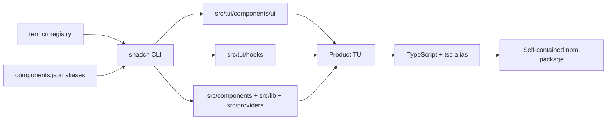
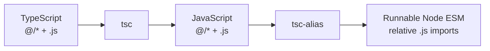
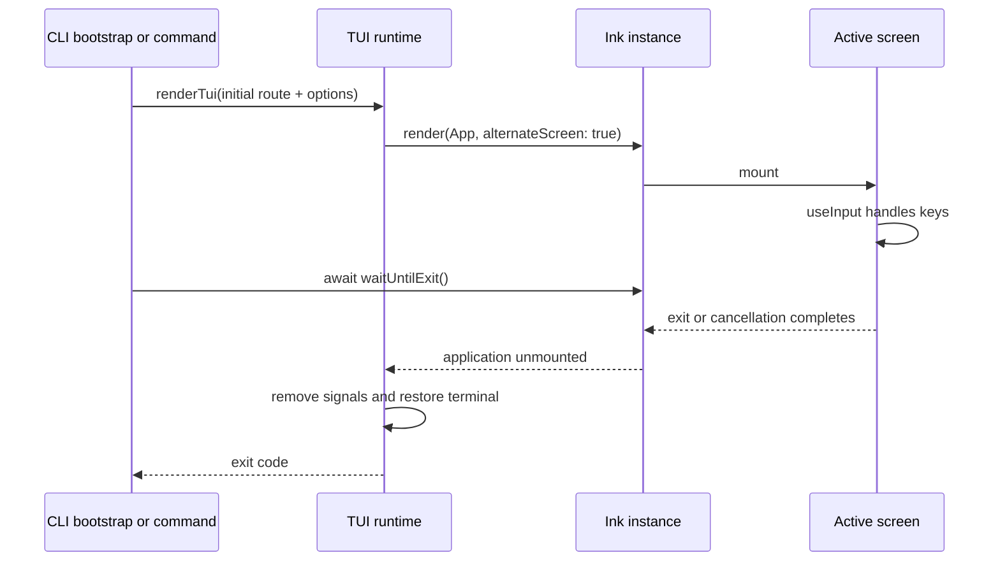

# Using termcn in this template

termcn provides terminal UI components for Ink and OpenTUI using the shadcn model: the registry
copies source into your project, giving you full ownership and no runtime lock-in.

This template uses the **Ink variant only**. Components become versioned application source; the
runtime and CI never contact the termcn registry.

## How the registry fits the project



After generation, the registry is no longer part of the execution path. Review and customize the
copied files like any other code in the repository.

## Registry configuration

`components.json` registers the termcn namespace:

```json
{
  "registries": {
    "@termcn": "https://termcn.dev/r/{name}.json"
  }
}
```

The aliases in the same file route each artifact to its real destination:

| Artifact                       | Destination             |
| ------------------------------ | ----------------------- |
| Shared component types         | `src/components`        |
| UI primitives                  | `src/tui/components/ui` |
| Hooks                          | `src/tui/hooks`         |
| Libraries, symbols, and themes | `src/lib`               |
| Theme providers                | `src/providers`         |
| TypeScript imports             | `@/*` → `src/*`         |

The repository's actual `components.json` is the source of truth. Do not replace its aliases with
generic paths copied from a web project.

## Add an Ink component

Always use the Ink registry path:

```bash
npx shadcn@latest add @termcn/ink/spinner
```

termcn also publishes an `@termcn/opentui/*` namespace, but it targets a different renderer and does
not belong in this template.

After generation:

1. review every new file and import;
2. keep primitives under `src/tui/components/ui`;
3. move product-specific compositions to `src/tui/components/app`;
4. confirm runtime packages are listed in `dependencies`, not only `devDependencies`;
5. normalize local imports so they end in `.js`;
6. run typecheck, tests, build, and the package smoke test;
7. commit the generated source.

Adding a component changes application code. A later registry update must be reviewed as a normal
diff because local customizations belong to the product.

## Node ESM and aliases

Generated source may import a primitive like this:

```tsx
import {Spinner} from '@/tui/components/ui/spinner.js'
```

Node ESM does not resolve `@/` by itself. The project uses `module: NodeNext` and
`moduleResolution: NodeNext`, so every local source import—including aliases copied from the
registry—ends in `.js`. TypeScript maps that specifier back to the corresponding `.ts` or `.tsx`
source.

The production build resolves the remaining alias:



Do not remove `tsc-alias` from the build. `npm run smoke:package` scans installed JavaScript and
fails if an unresolved `@/...` import reaches the tarball.

## Theme and component ownership

The explicit `ThemeProvider` lives at the TUI root. Screens should use semantic tokens instead of
repeating raw colors, allowing a product-wide theme change without rewriting individual components.

Product identity that also applies outside Ink lives in `src/terminal/brand.ts`. It owns purple
`#8B5CF6`, cyan `#22D3EE`, muted `#94A3B8`, and the Unicode/ASCII pairs for the mark (`◆`/`<>`)
and breadcrumb (`›`/`>`). Both the TUI theme and the oclif help renderer consume these neutral
tokens. The help renderer remains static terminal text: it does not import termcn components, mount
Ink, or enter the alternate screen.

The template's building blocks include:

- `AppShell` for header, content, and shortcut regions;
- `Breadcrumb`, `Alert`, and `Dialog` for route context, prominent feedback, and focused decisions;
- `ProgressBar` for measurable totals and product-level phase progress for indeterminate tasks;
- `CommandPalette` for `/` navigation;
- `Menu`, `Select`, and `Table` for navigable data;
- `Spinner` and the product-level `LogPanel` for long-running work;
- `Confirm`, `StatusMessage`, and `KeyboardShortcuts`;
- `ThemeProvider` for tokens and terminal capabilities.

Not every component needs to come directly from the registry. Product compositions can combine
termcn primitives and remain in `components/app`.

The dashboard shell is one such composition. It combines the branded header, breadcrumb, routed
content, mutually exclusive overlays, alerts, and contextual footer while leaving business state in
feature controllers. Its layout has three modes: compact below 90 columns or 28 rows, wide from 110
columns and 30 rows, and standard otherwise.

Registry source is reviewed before use. In particular, interactive breadcrumbs separate moving a
focus cursor from activating a route, dialogs suspend global shortcuts while their focus scope is
active, native controls consume input only while focused, and progress values are clamped to their
real range. Never estimate task completion from elapsed time: use a spinner and named phases when a
use case has no measurable total.

## Terminal capabilities

Presentation must respect:

- `NO_COLOR`: disable ANSI colors;
- `NO_UNICODE`: use ASCII-safe symbols;
- `NO_MOTION`: disable animation and time-dependent frames;
- `CI`: prefer deterministic, conservative output;
- `TERM=dumb`: keep static help ANSI-free and ASCII-safe;
- missing TTY capability: never mount the dashboard; commands use text and the root uses help.

For static help, any one of `NO_COLOR`, `NO_UNICODE`, or `TERM=dumb` selects the combined
ANSI-free, ASCII-safe fallback.

`--no-interactive` makes the same plain-text selection even with a TTY. `--json` takes priority over
TTY detection and `--no-interactive`.

Use `process.stdout.columns` or an Ink terminal-size hook for responsive layouts. Manually verify at
least 80×24 and 120×40. Automated visual tests should fix width and disable motion and Unicode.

## Ink lifecycle

Ink's `render()` returns an instance that owns the application lifecycle. This template mounts one
root with `alternateScreen: true` and waits for `waitUntilExit()` before returning control to the
CLI bootstrap or invoking command.



An empty invocation starts at Home. `task list`, `task run`, and `doctor` use the same root and set
their feature route as the initial destination. This keeps terminal lifecycle and global overlays
centralized while allowing oclif commands to select the relevant screen.

`useInput` coordinates keyboard handling and automatically works with raw stdin input. A running
task interprets `Ctrl+C` as cancellation; an idle application interprets it as exit. `Esc` provides
a local navigation or exit path.

Signal handlers, raw mode, cursor visibility, and the alternate screen must always be restored in a
`finally` block.

## Validation checklist

After adding or updating termcn source, run:

```bash
npm run typecheck
npm test
npm run build
npm run smoke:package
```

Also confirm that:

- generated files landed in the configured directories;
- no OpenTUI-only component entered the Ink application;
- local imports use `.js` specifiers;
- the packaged build contains no unresolved aliases;
- dashboard and static help still consume the shared brand tokens;
- visual tests remain deterministic with motion and Unicode disabled.

## References

- [termcn registry documentation](https://www.termcn.dev/docs/registry)
- [termcn](https://www.termcn.dev/)
- [Ink](https://github.com/vadimdemedes/ink)
