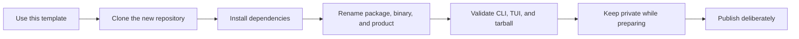
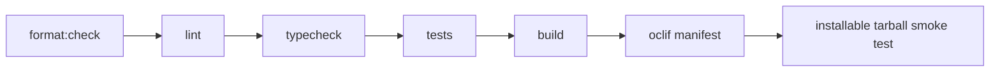
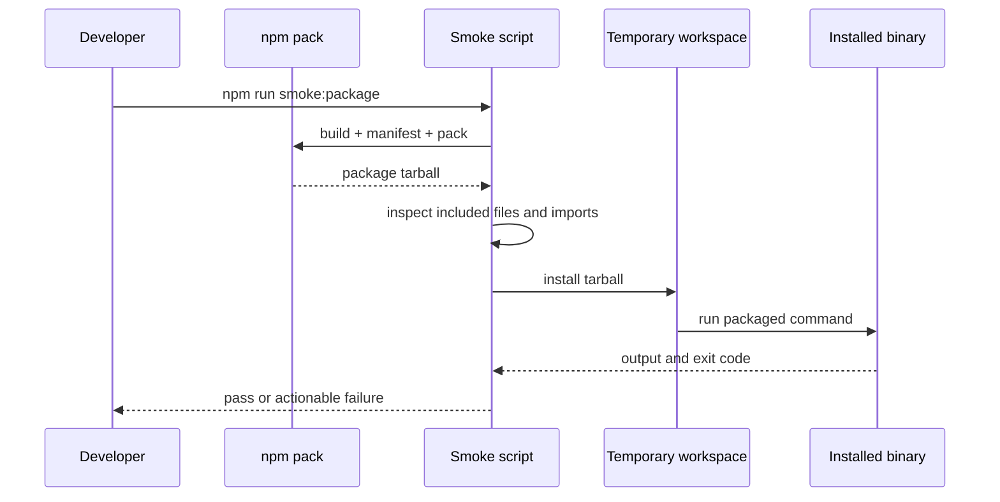

# Using and customizing the template

This repository is designed to become a new product, not to remain a demo forever. Use this guide
to create a repository, replace every placeholder consistently, validate both interfaces, and keep
publication disabled until ownership is ready.

## Template journey



## Create a project

1. In the source repository, confirm that **Settings → General → Template repository** is enabled.
2. Select **Use this template → Create a new repository**.
3. Choose the owner, repository name, and visibility.
4. Clone the new repository.
5. Install dependencies with `npm install`.

GitHub does not copy commit history, branches, secrets, environments, protection rules, or publishing
configuration from a template. Recreate those settings when the new project needs them.

## Required customization checklist

Replace the placeholders as one coordinated change:

- [ ] Change `package.json#name` from `my-cli` to the intended npm package name.
- [ ] Change the `package.json#bin` key from `mycli` to the executable name.
- [ ] Update `description`, `author`, `homepage`, `bugs`, and `repository`.
- [ ] Update `package.json#oclif#bin` and any help or example references to the binary.
- [ ] Replace the README title, positioning, examples, links, badges, and introductory copy.
- [ ] Update the product name and description shown by the TUI header and theme.
- [ ] Review remaining placeholders with:

  ```bash
  rg -n "my-cli|mycli|cli-template"
  ```

- [ ] Update the copyright holder and year in `LICENSE` when appropriate.
- [ ] Change the registry URL in `components.json` only if the project uses a different registry;
      most projects should keep the existing termcn URL.

After changing package metadata, run `npm install` so npm updates the lockfile. Never edit
`package-lock.json` manually.

## Validate the customized product

The verification path moves from fast static checks to the artifact users will install.



Run:

```bash
npm run format:check
npm run lint
npm run typecheck
npm test
npm run build
npm run manifest
npm run smoke:package
```

`npm run check` aggregates the main local checks through manifest generation. The package smoke
test remains explicit because it builds, inspects, installs, and executes the tarball.

## Validate both interfaces manually

Test the TUI in at least an 80×24 and a 120×40 terminal:

```bash
./bin/run.js
./bin/run.js task list --interactive
./bin/run.js doctor --interactive
```

Confirm every item below before the first merge:

- the root command opens the TUI when stdin and stdout are TTYs;
- the root command prints help and exits when no TTY is available;
- `doctor --json` and `task list --json` produce parseable JSON without ANSI;
- `--interactive --json` fails with exit code `2`;
- cancelling a task leaves no orphan process and restores the terminal;
- the tarball contains the build, bins, manifest, README, and license;
- the tarball excludes source files, tests, internal docs, and secrets;
- packaged JavaScript contains no unresolved `@/...` imports.

## Understand what the smoke test protects



Direct execution from `src/` cannot reveal missing package files, broken bins, stale manifests, or
unresolved aliases in emitted JavaScript. The smoke test exists to catch those packaging-only
failures.

## Publish deliberately

The template starts with `"private": true`. Keep that guard while the package name, metadata,
ownership, and release process are unfinished.

When the project is ready:

1. confirm that the package name is available in the intended npm registry;
2. inspect the artifact with `npm pack --dry-run`;
3. review every file npm plans to publish;
4. remove `"private": true` consciously;
5. define an appropriate `publishConfig`, especially for scoped packages;
6. configure registry authentication and provenance outside the repository.

The template does not ship a release or automatic-publishing workflow. Adding one is an explicit
product decision. Never commit registry tokens, provenance credentials, or other secrets.

## Recommended next steps

- Remove example commands that do not belong in the product.
- Replace theme tokens before customizing individual components.
- Keep oclif classes and Ink screens as adapters over shared use cases.
- Use the repository's `$create-command` Codex skill for new command scaffolds.
- Follow [Adding a command and screen](adding-a-command.md) for production behavior.
- Update the README whenever public JSON or exit codes change.
- Record new dependency rules and cross-feature contracts in [Architecture](architecture.md).
